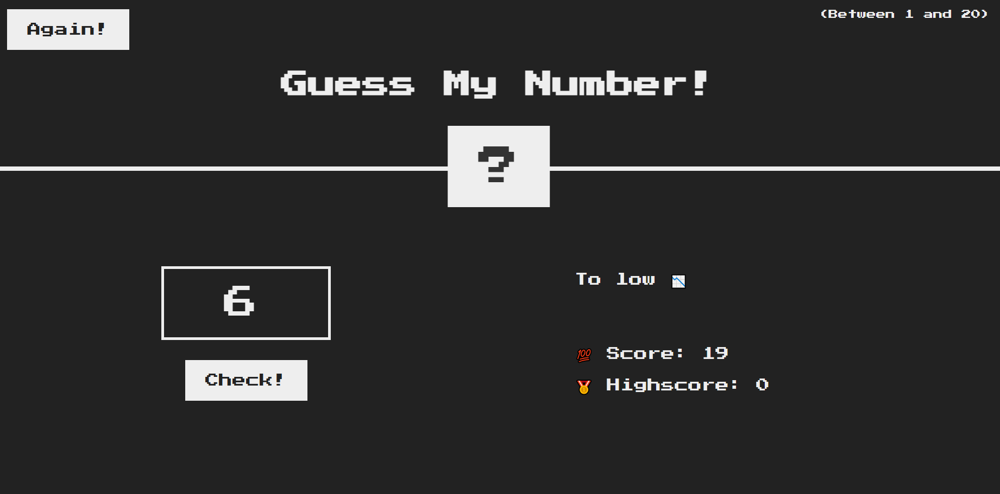
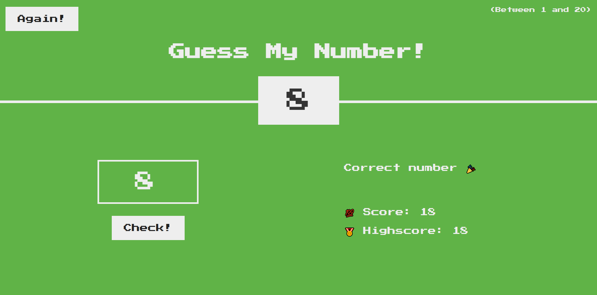

# guessmynumber
Guess My Number Game

The Guess My Number Game is a simple browser-based game developed using HTML, CSS, and JavaScript. Players aim to guess a number between 1 and 20. 
The game provides hints; if the guessed number is smaller than the target, it notifies the player that the number is too small, and if the guessed number is larger, it indicates that the number is too big.
The game starts with 20 points, and each incorrect guess deducts 1 point.

Features
Guessing Mechanism
Players input a number and receive feedback if their guess is too small or too big compared to the target number.

Scoring System
The game starts with 20 points, and players lose 1 point for each incorrect guess.

Win Condition
Players win by correctly guessing the target number within the allotted points or before reaching zero points.

Installation
Clone this repository to your local machine using git clone.
Open the index.html file in a web browser.

How to Play
Input a number between 1 and 20 into the input field.
Receive feedback about the size of your guessed number compared to the target number.
Continue guessing until you correctly guess the number or run out of points.
